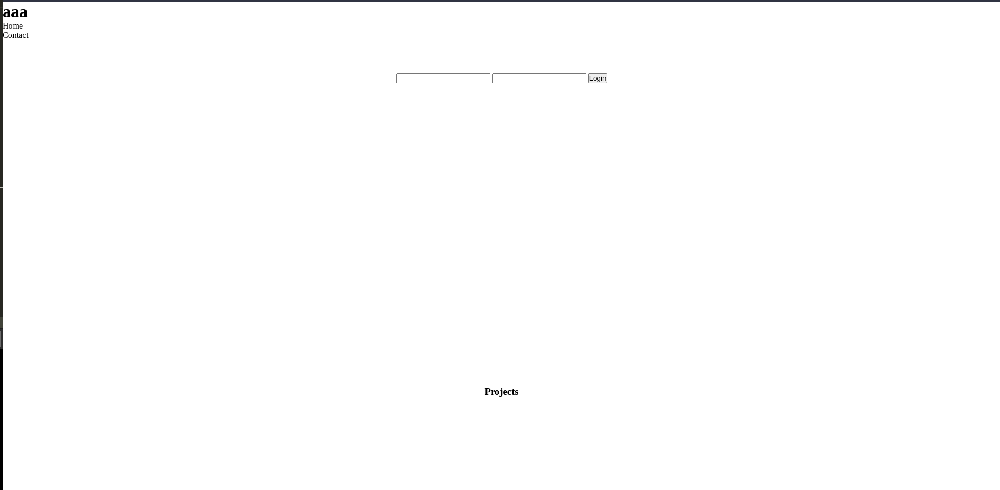
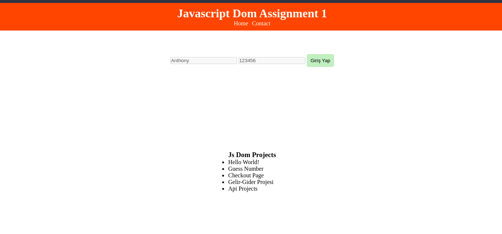

### JavaScript DOM Assignment 1

### Amaç:

- Bu görevin amacı, öğrendiklerinizi pekiştirmek. JS DOM kullanarak verilen html yapısını aşağıdaki adımlarla modifiye etmeniz beklenmektedir. HTML Çıktısının şuanki hali ve JS eklendikten sonraki örnek yapısı aşağıdaki resimlerde verilmiştir.

### Before

### After

